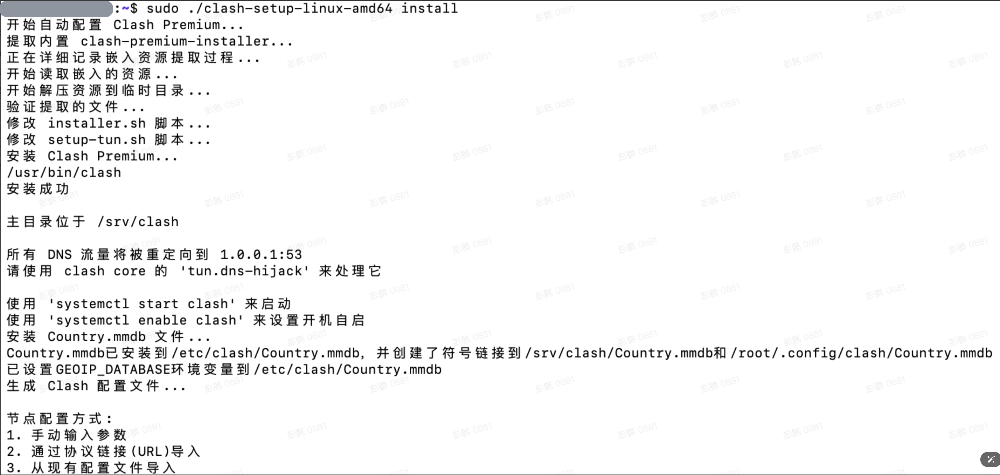

# Clash-tutorial-for-Olares

This repository is a tutorial that shares how to configure Clash for the Olares system.

[中文文档](README_CN.md)

# Install clash using automated tools

## Accessing the Olares Host
You can remotely connect to the Olares host via SSH command or access it through the control panel.

### Remote Access via SSH
Ensure your device and the Olares host are on the same local network, then use the following command to connect:
```
ssh hostname@host_IP
# For example: ssh olares@192.168.x.x
```
Enter the password when prompted to access remotely.

### Via Desktop Control Hub
Open the control panel in Olares, click on Terminal > Olares in the left panel.


## Download Clash Management Tool
1. Execute the following command to download the tool:
    ```
    wget https://github.com/BBBigDan/Clash-tutorial-for-Olares/releases/download/v0.1.0/clash-setup-linux-amd64
    ```
2. Add execution permission to clash-setup-linux-amd64:
    ```
    chmod +x clash-setup-linux-amd64 
    ```

## Install Clash
Execute the following command to install:

```
./clash-setup-linux-amd64 install
```

When connecting via SSH, add sudo before the command:

```
sudo ./clash-setup-linux-amd64 install
```

After successful installation, the command line will prompt you to select a node configuration method:



## Configure Proxy Nodes
Example using protocol link (URL) import:
1. Select configuration method 2:
    ```
    Please select configuration method (1/2/3): 2
    ```
2. Enter the proxy URL:
    ```
    Please enter proxy URL: vmess://
    ```
The result will look like:


3. Select a default proxy based on available proxies:
    ```
    Please select default proxy (enter number): 1
    ```
The result will look like:


## Check if the Service is Running
1. Use the following command to check service status:

    ```
    ./clash-setup-linux-amd64 status
    ```

    When connecting via SSH, add sudo before the command:

    ```
    sudo ./clash-setup-linux-amd64 status
    ```

    Check the status - "running" means success, other statuses indicate failure.

    

    Press q to exit if there's an error status.

2. Check if you can access the internet:

    ```
    curl https://www.google.com
    ```

    If a webpage is returned, the service is working properly.

    

## Managing Proxy Nodes
To manage nodes, execute the following command:

```
./clash-setup-linux-amd64 proxy
```

When connecting via SSH, add sudo before the command:

```
sudo ./clash-setup-linux-amd64 proxy
```


Follow the prompts to complete the corresponding operations.

# Manually Installing Clash

First, we need to install Clash on the device. Since we want to enable TUN mode, we will choose clash-premium.
Use the [clash-premium-installer](https://github.com/Kr328/clash-premium-installer), which is an installer for clash-premium. This installer also requires clash-core to function, and you can use the backup repository [Kuingsmile/clash-core]((https://github.com/Kuingsmile/clash-core)) (the original author of Clash has unfortunately left ヽ( ຶ▮ ຶ)ﾉ!!!).

## References
- [Clash Knowledge Base](https://clash.wiki/configuration/getting-started.html)
- [Tutorial 1](https://www.moralok.com/2023/05/27/how-to-install-clash-on-ubuntu/)
- [Tutorial 2](https://thatcoders.github.io/Clash%20For%20Linux/)
- [Tutorial 3](https://kazusa.cc/geek/understanding-clash-configuration-files-in-one-article.html)

## Installation Points

- Make sure to choose the premium version of clash-core, premium version, premium version (important things should be repeated three times).

- Modify the script `installer.sh` in [clash-premium-installer](https://github.com/Kr328/clash-premium-installer). Change the github repo address from `Dreamacro/clash` to `Kuingsmile/clash-core`
    ```
    sed -i 's/Dreamacro\/clash/Kuingsmile\/clash-core/g' installer.sh
    ```
- Modify the script `scripts/setup-tun.sh`, add two rules to the nftable configuration.
  ```

  ...
  
      chain local-dns-redirect {
        type nat hook output priority 0; policy accept;
        
        ip protocol != { tcp, udp } accept
        
        meta cgroup $BYPASS_CGROUP_CLASSID accept
        ip daddr 127.0.0.0/8 accept
        ip daddr 10.0.0.0/8 accept
        
        udp dport 53 dnat $FORWARD_DNS_REDIRECT
        tcp dport 53 dnat $FORWARD_DNS_REDIRECT
    }

  ...

      chain forward-dns-redirect {
        type nat hook prerouting priority 0; policy accept;
        
        ip protocol != { tcp, udp } accept
        ip daddr 10.0.0.0/8 accept
        
        udp dport 53 dnat $FORWARD_DNS_REDIRECT
        tcp dport 53 dnat $FORWARD_DNS_REDIRECT
    }

  ...
  ```

- Now you can install the premium version clash
  ```
  ./installer.sh install
  ```

- The default path for the configuration file is /srv/clash/config.yaml.

- The Country.mmdb file will be automatically downloaded when Clash starts, but it may not download successfully (you know the reason; otherwise, why would you need a VPN? Sigh, what a strange dependency—starting a VPN requires having a working VPN ヽ( ຶ▮ ຶ)ﾉ!!!). In such cases, you'll need to manually download Country.mmdb and copy it to the corresponding directory. You can find the download link in the logs after Clash starts, and the storage directory can also be found in the logs. If you can't find it, the default paths are `~/.config/clash/Country.mmdb` or `/root/.config/clash/Country.mmdb`.
- Enabling TUN mode may require configuring the `/etc/systemd/resolved.conf` file, which should look something like this 👇
    ```
    DNS=127.0.0.1 
    FallbackDNS=114.114.114.114 
    DNSStubListener=no
    ```
