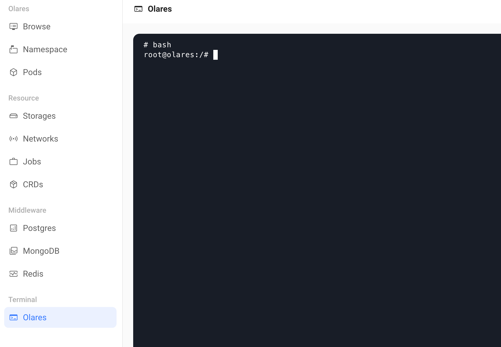
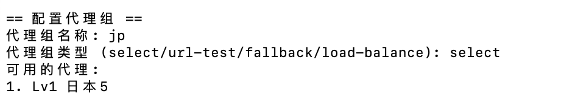
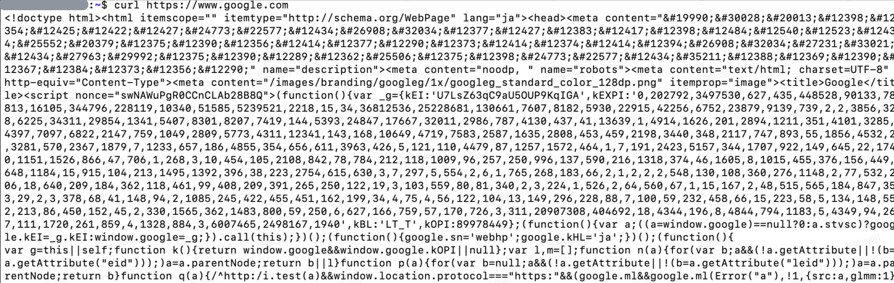

# Olares系统的Clash配置教程

本仓库是一个教程，分享如何为Olares系统配置Clash。

[English Documentation](README.md)

# 使用自动化工具安装Clash

## Video
[guide video](https://github.com/user-attachments/assets/edf6a4d2-d087-4047-841d-3949e8eb2132)

## 访问 Olares 主机
你可以通过 SSH 命令远程连接 Olares 主机，或通过控制面板访问 Olares 主机。
### 使用 SSH 远程访问
保证你的设备和 Olares 主机在同一局域网下，使用以下命令远程连接：
```
ssh hostname@主机 IP
# 例如： ssh olares@192.168.x.x
```
按要求输入密码后即可远程访问。

### 通过桌面的控制面板（Control Hub）
在 Olares 中打开控制面板，在左侧面板点击终端 > Olares



## 下载 Clash 管理工具
1. 执行下列命令下载工具: 
    ```
    wget https://github.com/BBBigDan/Clash-tutorial-for-Olares/releases/download/v0.1.0/clash-setup-linux-amd64
    ```
2. 给 clash-setup-linux-amd64 增加执行权限：
    ```
    chmod +x clash-setup-linux-amd64 
    ```

## 安装 Clash
执行下列命令安装clash: 

    ```
    ./clash-setup-linux-amd64 install
    ```
使用 SSH 方式连接 Olares 时，在命令前加上 sudo：

    ```
    sudo ./clash-setup-linux-amd64 install
    ```

安装成功后，命令行返回提示并要求选择节点配置方式：


## 配置节点
以通过协议链接(URL)导入为例：
1. 选择对应的配置方式 2:
    ```
    请选择配置方式 (1/2/3): 2
    ```
2. 输入代理 URL:
    ```
    请输入代理URL: vmess://
    ```
返回结果为：



3. 根据可用的代理，选择默认代理：
    ```
    请选择默认代理 (输入序号): 1
    ```
返回结果为：


## 检查服务是否启动
1. 使用以下命令检查服务状态：

    ```
    ./clash-setup-linux-amd64 status
    ```

    使用 SSH 方式连接 Olares 时，在命令前加上 sudo：

    ```
    sudo ./clash-setup-linux-amd64 status
    ```

    查看状态，running 代表成功，其它状态代表失败。

    

    状态错误时，按q退出。


2. 检查是否可以联网：

    ```
    curl https://www.google.com
    ```

    如果有网页返回，代表服务已经正常工作。

    

## 管理节点
如需管理节点，执行以下命令：

```
./clash-setup-linux-amd64 proxy
```

使用 SSH 方式连接 Olares 时，在命令前加上 sudo：

```
sudo ./clash-setup-linux-amd64 proxy
```


根据提示完成相应操作。

# 手动安装Clash

首先，我们需要在设备上安装Clash。由于我们希望启用TUN模式，我们将选择clash-premium版本。
使用[clash-premium-installer](https://github.com/Kr328/clash-premium-installer)，这是一个clash-premium的安装程序。此安装程序还需要clash-core才能运行，您可以使用备份仓库[Kuingsmile/clash-core](https://github.com/Kuingsmile/clash-core)（Clash的原作者不幸离开了 ヽ( ຶ▮ ຶ)ﾉ!!!）。

## 参考资料
- [Clash知识库](https://clash.wiki/configuration/getting-started.html)
- [教程1](https://www.moralok.com/2023/05/27/how-to-install-clash-on-ubuntu/)
- [教程2](https://thatcoders.github.io/Clash%20For%20Linux/)
- [教程3](https://kazusa.cc/geek/understanding-clash-configuration-files-in-one-article.html)

## 安装要点

- 确保选择clash-core的premium版本，premium版本，premium版本（重要的事情要说三遍）。

- 修改[clash-premium-installer](https://github.com/Kr328/clash-premium-installer)中的`installer.sh`脚本。将github仓库地址从`Dreamacro/clash`更改为`Kuingsmile/clash-core`
    ```
    sed -i 's/Dreamacro\/clash/Kuingsmile\/clash-core/g' installer.sh
    ```
- 修改脚本`scripts/setup-tun.sh`，向nftable配置中添加两条规则。
  ```

  ...
  
      chain local-dns-redirect {
        type nat hook output priority 0; policy accept;
        
        ip protocol != { tcp, udp } accept
        
        meta cgroup $BYPASS_CGROUP_CLASSID accept
        ip daddr 127.0.0.0/8 accept
        ip daddr 10.0.0.0/8 accept
        
        udp dport 53 dnat $FORWARD_DNS_REDIRECT
        tcp dport 53 dnat $FORWARD_DNS_REDIRECT
    }

  ...

      chain forward-dns-redirect {
        type nat hook prerouting priority 0; policy accept;
        
        ip protocol != { tcp, udp } accept
        ip daddr 10.0.0.0/8 accept
        
        udp dport 53 dnat $FORWARD_DNS_REDIRECT
        tcp dport 53 dnat $FORWARD_DNS_REDIRECT
    }

  ...
  ```

- 现在您可以安装premium版本的clash
  ```
  ./installer.sh install
  ```

- 配置文件的默认路径是/srv/clash/config.yaml。

- Clash启动时会自动下载Country.mmdb文件，但可能无法成功下载（你知道原因；否则，你为什么需要VPN呢？唉，多么奇怪的依赖关系——启动VPN需要已经有一个可用的VPN ヽ( ຶ▮ ຶ)ﾉ!!!）。在这种情况下，你需要手动下载Country.mmdb并将其复制到相应的目录。你可以在Clash启动后的日志中找到下载链接，存储目录也可以在日志中找到。如果找不到，默认路径是`~/.config/clash/Country.mmdb`或`/root/.config/clash/Country.mmdb`。
- 启用TUN模式可能需要配置`/etc/systemd/resolved.conf`文件，它应该看起来像这样👇
    ```
    DNS=127.0.0.1 
    FallbackDNS=114.114.114.114 
    DNSStubListener=no
    ``` 
